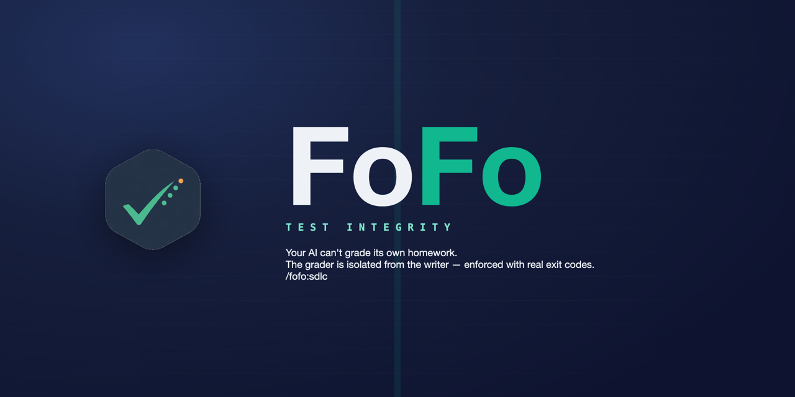
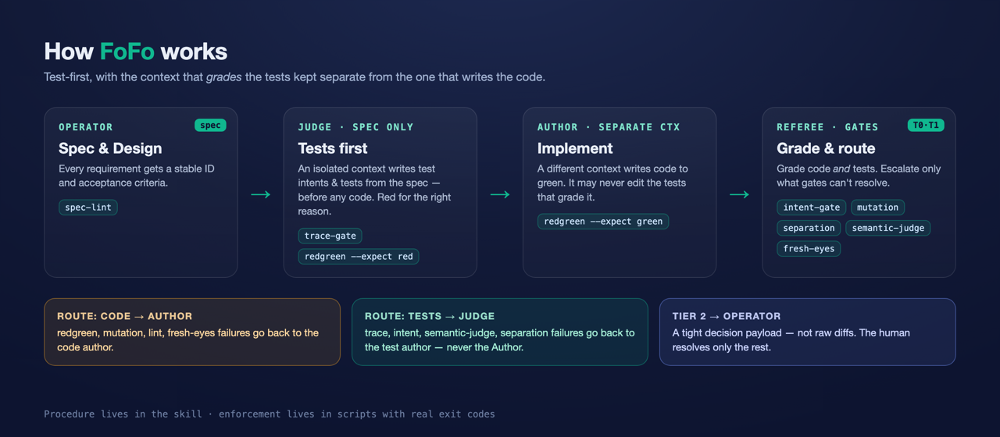

<p align="center">
  
</p>

<p align="center">
  <a href="#install"></a>
  
  
  
  
  
</p>

<h1 align="center">FoFo — Test Integrity for AI Coding Agents</h1>

<p align="center">
  <b>Your AI can't grade its own homework.</b><br>
  A test-integrity layer for AI coding agents: the context that <i>grades</i> the tests is isolated
  from the context that <i>writes</i> the code, and test <b>quality</b> is enforced by
  <b>scripts that exit non-zero</b> — not instructions the model is trusted to follow.
</p>

<p align="center">
  <i>Not another spec framework. A verification layer that sits under whatever spec or TDD workflow you already use.</i>
</p>

<p align="center">
  <b>See it pass in ~30s</b> — no API key:<br>
  <code>cd plugins/fofo/skills/sdlc/examples/sample-feature && bash smoke.sh</code> → <code>ALL CHECKS PASSED</code>
</p>

---

## Why

AI agents write tests that pass. That's the problem. A test the same context wrote to match the code it just wrote proves almost nothing — it locks in behavior without judging it. FoFo fixes the *trust* of your tests:

- An **independent context (the Judge)** writes the tests from the spec, **before any code exists**.
- A **separate context (the Author)** writes code to pass tests it didn't write and **cannot silently weaken**.
- A **gate runner (the Referee)** grades the **code _and_ the tests** — assertion intent, traceability, separation, secrets — and escalates to a human **only what the gates can't resolve**.

Procedure lives in the skill. **Enforcement lives in scripts with real exit codes**, so it can't be summarized away or gamed.

## How this differs

If you know **[TDD-Guard](https://github.com/nizos/tdd-guard)** — the closest neighbor — here's the delta. TDD-Guard polices the *order* of red → green → refactor (no implementation without a failing test, no over-implementation). FoFo adds the two things order alone can't give you:

1. **Context separation.** The test-author context and the code-author context are *different* (`separation-gate`), so the agent structurally can't write tests with the same blind spots as the code it's about to write. Cycle-ordering can't catch a test authored to match the implementation.
2. **Test-quality grading.** `intent-gate` grades the **tests themselves** — assertion-free, trivially-true, snapshot-only, and banned-mock tests *fail the gate*, via a real AST parse — not just "a failing test existed first."

**Mutation testing is complementary, not competing.** "Tests that pass" ≠ "tests that catch" — mutation testing is the gold standard for the latter. FoFo treats `mutation` (and `coverage`, `lint`) as **bring-your-own gates wrapped to the same contract**: point it at your mutation tool and it runs in the same pipeline and routes failures the same way. FoFo absorbs that approach rather than replacing it.

## Install

In [Claude Code](https://code.claude.com):

```text
/plugin marketplace add Sweet-Papa-Technologies/Agentic-SDLC
/plugin install fofo@fofo-marketplace
```

Then use it with `/fofo:sdlc`, or just describe a spec-to-code task ("implement this from the spec", "write tests TDD") and Claude loads it automatically. The **Judge** and **Reviewer** subagents auto-load — check `/agents`.

> Works on **Claude Code** out of the box; the same folder is format-compatible with other `SKILL.md`-consuming agents (Cursor, Codex CLI, Gemini CLI). See [INSTALL.md](./plugins/fofo/skills/sdlc/INSTALL.md).

## How it works

<p align="center">
  
</p>

Four roles, run as separate contexts where the host allows (see [Guarantees & limits](#guarantees--limits)):

| Role | Who | Sees | Never does |
|------|-----|------|------------|
| **Operator** | the human | everything | owns spec sign-off, escalations, security |
| **Judge** | sub-agent, spec-only | spec + test intents | see the implementation |
| **Author** | separate context | tests + code | edit the tests that grade it |
| **Referee** | gate scripts | the diff | make calls scripts can't |

When verification fails, the runner tags each escalation with a **route**: `code` failures go back to the Author, `tests` failures go back to the Judge in a fresh pass. **The Author never edits the tests that grade it.**

## The gates

Every gate — kept or bring-your-own — obeys one I/O contract (`--changed --policy`, prints one JSON verdict, exits `0` pass / `1` fail / `2` escalate / `3` skip). Mix and match; point config at your stack.

| Gate | Tier | What it checks | Default |
|------|:----:|----------------|:-------:|
| `spec-lint` | 0 | every requirement has an ID + acceptance criteria | ✅ on |
| `trace-gate` | 0 | every requirement maps to ≥1 test; flags orphan tests | ✅ on |
| `redgreen-gate` | 0 | suite is red before code, green after | ✅ on |
| `intent-gate` | 0 | catches assertion-free / trivially-true / snapshot-only / banned-mock tests — depth varies by language (see [below](#guarantees--limits)) | ✅ on |
| `secret-scan` | 0 | deterministic hard-coded-secret detector (AWS keys, PEM private keys hard-fail; secret-looking assignments escalate) — key-free, no network | ✅ on |
| `separation-gate` | 0 | fails if one context authored both the tests and the code for a unit | ⚙️ opt-in |
| `flake-gate` | 0 | re-runs the suite N times; fails if the result is non-deterministic (a flaky test is an untrustworthy test) | ⚙️ opt-in |
| `diff-budget` | 0 | caps changed lines so a PR stays small enough to actually review (Phase 7); git-diff or line-count mode | ⚙️ opt-in |
| `mutation` · `coverage` · `lint` | 0 | **bring your own** command, wrapped to the contract | ⚙️ opt-in |
| `semantic-test-judge` | 1 | model judges whether each test asserts requirement *intent* vs. just touching lines | ⚙️ opt-in |
| `fresh-eyes-review` | 1 | model scans the diff for cheating, security, silent architecture changes | ⚙️ opt-in |

No mutation/coverage/lint/model-proxy/language is hardcoded. Heavy and model gates are **disabled by default**, so a fresh install runs the language-agnostic gates immediately with nothing else installed.

## Guarantees & limits

Two things a careful adopter should know up front. Both are honest seams, not surprises.

**Separation is as hard as your host.** On a host that can truly isolate contexts — e.g. **Claude Code subagents** — the Judge literally cannot read the implementation, and `separation-gate` is a *hard* guarantee. On a host that can't isolate contexts, separation degrades to a **convention**, and `separation-gate` falls back to an after-the-fact heuristic: did the same session author both the tests and the code, per the provenance manifest? Today the hard guarantee holds on **Claude Code (subagents)**; elsewhere it is best-effort.

**`intent-gate` depth varies by language.** The *contract* is stack-agnostic — one I/O shape, point it at any stack — but enforcement *depth* is not uniform yet:

| Language | `intent-gate` depth |
|----------|---------------------|
| JavaScript / TypeScript | **Full AST** (vendored `acorn` parser) — precise structural detection |
| JSX / TSX, other languages | **Token-level** heuristics (assertion-free / trivially-true / banned-mock) |
| Anything else | **Bring your own** parser behind the same JSON contract — see [porting](./plugins/fofo/skills/sdlc/references/porting-to-other-languages.md) |

So depth is deepest on JS/TS today and token-level elsewhere until per-language parsers are added. The other Tier-0 gates (`spec-lint`, `trace-gate`, `redgreen-gate`, `secret-scan`, `separation-gate`) are genuinely language-agnostic, and `redgreen` works against any test command you configure.

## Quickstart (per repo)

```bash
# 1. drop in the config (one time, from the installed plugin dir)
cp "$HOME/.claude/plugins/marketplaces/fofo-marketplace/plugins/fofo/skills/sdlc/gates.config.example" gates.config
cp "$HOME/.claude/plugins/marketplaces/fofo-marketplace/plugins/fofo/skills/sdlc/policy.json" policy.json

# 2. point red/green at your test command (policy.json -> gates.redgreen-gate.test_command)

# 3. run the whole gate runner over your changes
"$HOME/.claude/plugins/.../skills/sdlc/scripts/gate-runner" \
  --config gates.config --changed "src/**/* test/**/*"
```

Or just run `/fofo:sdlc` and let the skill choreograph the phases.

## What's in the box

```
Agentic-SDLC/                         # project home AND plugin marketplace
├── .claude-plugin/marketplace.json   # this catalog
├── assets/                           # logo, banner, icons, diagram
└── plugins/fofo/
    ├── .claude-plugin/plugin.json    # plugin manifest
    ├── agents/                       # Judge + Reviewer subagents (auto-load)
    └── skills/sdlc/                  # the skill: SKILL.md, gate scripts, references, runnable smoke tests
```

Deep docs ship with the skill:
[`SKILL.md`](./plugins/fofo/skills/sdlc/SKILL.md) ·
[gate contract](./plugins/fofo/skills/sdlc/references/gate-contract.md) ·
[phases & roles](./plugins/fofo/skills/sdlc/references/phases.md) ·
[porting to other languages](./plugins/fofo/skills/sdlc/references/porting-to-other-languages.md) ·
[design notes](./plugins/fofo/skills/sdlc/BUILD-NOTES.md)

## Verify it yourself

The skill ships runnable end-to-end smoke tests (no API key needed — the model gate is exercised against a local mock):

```bash
cd plugins/fofo/skills/sdlc/examples/sample-feature && bash smoke.sh   # the full loop
cd plugins/fofo/skills/sdlc/examples/security-gates  && bash smoke.sh   # secret-scan, dogfooded
# -> ALL CHECKS PASSED
```

For a fast inner-loop check of the gate internals (no model, no test suite spawned), run the unit harness:

```bash
python3 plugins/fofo/skills/sdlc/scripts/selftest
# -> OK
```

## Updating

Bump `version` in `plugins/fofo/.claude-plugin/plugin.json` and the matching entry in `.claude-plugin/marketplace.json`, commit, tag with `claude plugin tag ./plugins/fofo`, and push. Users get it via `/plugin marketplace update fofo-marketplace`.

## Contributing & License

Contributions welcome — see [CONTRIBUTING.md](./CONTRIBUTING.md). Brand assets and usage in [BRANDING.md](./BRANDING.md).

MIT © 2026 Forrester Terry. Bundles [acorn](https://github.com/acornjs/acorn) (MIT). See [LICENSE](./LICENSE).
